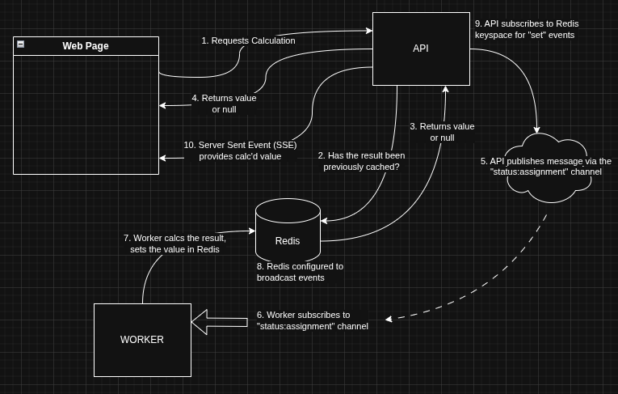

# Fibi Overkill

An "over the top" web application with more services than necessary to calculate Fibonacci numbers. The purpose is to demonstrate how to build a more complex multi-container application.

## Message Routing

### Custom Redis Image

Configure Redis to publish [keyspace notifications](https://redis.io/docs/latest/develop/pubsub/keyspace-notifications/)

## Next Steps

137. Deployment plan:
   1. Push to GitHub
   2. Build a test image and test
   3. Build a production image
   4. Push production image to DockerHub
   5. GitHub pushes project to AWS EB
   6. EB pull images from DockerHub, deploys
138. Convert existing dev docker files to production
139. The client dev server does not exist in production
     1.   Recall multi phase builds from earlier
     2.   Static files will be served by a dedicated server behind the proxy server
     3.   In other words, the proxy server only routes requests, it does not serve files
140. Client server may need to be configured to work with React Router
141. Create custom config file and multi phase build
142. Create tests for the client, worker, and api
143. <NoNotes/>
144. GitHub Actions Script?
     1.   Specify docker as dependency
     2.   Build test version of React project
     3.   Run tests
     4.   Build prod version of all projects
     5.   Push all to docker hub
     6.   Tell AWS EB to update
145. Determine GitHub Actions on pushed and merged branches
146. `docker login` Can GitHub Actions push images to DockerHub?
147. Test workflow, should successfully complete steps 1 thru 4 in deployment plan
148. Compare code here with your project code